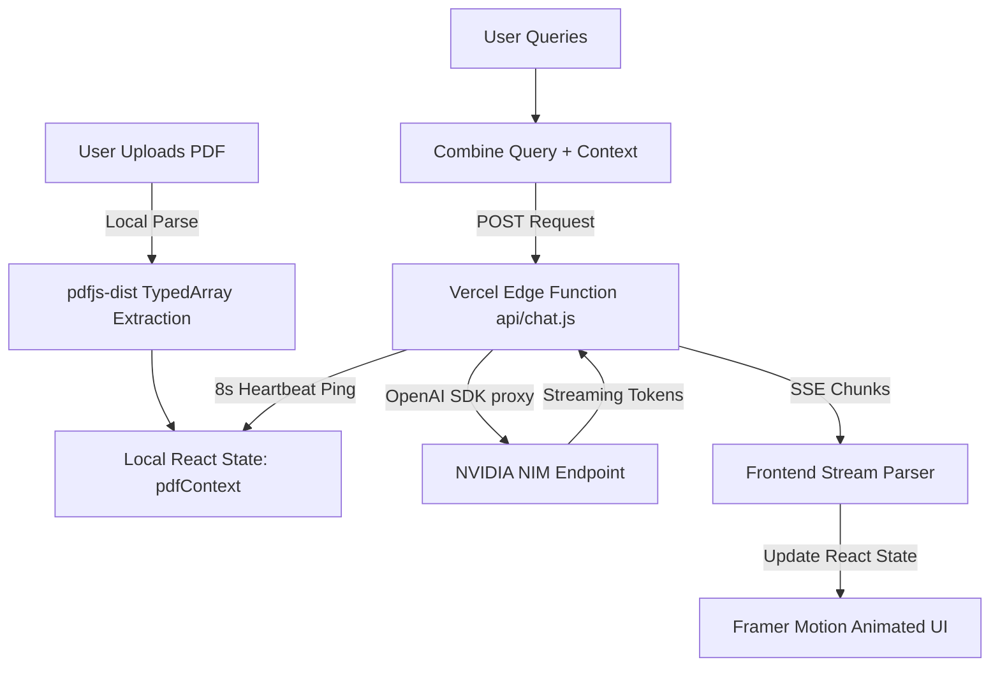

# CiteRAG 🌌: The Comprehensive Technical Deep Dive

CiteRAG is an enterprise-grade, hyper-optimized Retrieval-Augmented Generation (RAG) framework. This document serves as the absolute source of truth for the architecture, engineering decisions, and internal pipeline mechanisms of both the serverless web application and the standalone Python Retrieval engine.

<p align="center">
  <a href="https://www.youtube.com/watch?v=HRmyFI5p0Fk" target="_blank" rel="noopener noreferrer">
    
  </a>
</p>
<p align="center" style="font-size: 0.9em; color: #6e7681;">
  <em>Click thumbnail to watch the 60-second technical deep dive • Verified Grounded RAG Architecture</em>
</p>

---

## 📑 Table of Contents
1. [System Architecture Overview](#1-system-architecture-overview)
2. [Frontend Mechanics (React + Vite)](#2-frontend-mechanics-react--vite)
3. [Edge Network Backend (`api/chat.js`)](#3-edge-network-backend-apichatjs)
4. [Advanced Information Retrieval (Python Backend)](#4-advanced-information-retrieval-python-backend)
5. [Model Specifications & Routing](#5-model-specifications--routing)
6. [Deployment & Environment](#6-deployment--environment)

---

## 1. System Architecture Overview

CiteRAG operates across a dual-architecture paradigm:

### A. The Serverless Web Application
A privacy-first, zero-retention web app deployed on Vercel. 
- Documents are parsed **locally** in the user's browser.
- Context is hydrated dynamically and sent to Vercel Edge functions.
- The Edge functions communicate with NVIDIA NIM (NVIDIA Inference Microservices) APIs.
- Responses stream back to the client via Server-Sent Events (SSE).

### B. The Python IR Pipeline
A standalone Python pipeline (`backend_retrieval.py`) designed for robust offline or server-side chunking. It features advanced concepts like list-aware semantic chunking, intent-classification boosting, and strict hallucination gating.



---

## 2. Frontend Mechanics (React + Vite)

The frontend is housed entirely within `src/components/ChatInterface.jsx` and built on React 19.

### Local Document Parsing (`pdfjs-dist`)
To guarantee data privacy, PDFs are never sent to a backend server for parsing. 
1. `pdfjs-dist` is imported and configured with a CDN-hosted web worker (`pdf.worker.min.mjs`) to avoid Vite bundling restrictions.
2. When a file is uploaded, an `ArrayBuffer` is read and converted to a `Uint8Array`.
3. `pdfjsLib.getDocument({ data: typedArray })` parses the binary tree.
4. The system iterates from `page 1` to `pdf.numPages`, calling `.getTextContent()` and mapping the `items.str` arrays into a giant concatenated `pdfContext` string.

### The Stream Parser Engine
When the backend streams data back, the frontend utilizes the Web Streams API:
```javascript
const reader = response.body.getReader();
const decoder = new TextDecoder();
```
Because TCP chunks can split halfway through a JSON string, a `buffer` variable retains incomplete lines. The parser splits by `\n`, pops the incomplete string back into the buffer, and evaluates the complete JSON lines:
- **`custom_event === "keep_alive"`**: Ignored silently. Prevents Vercel connection drop.
- **`custom_event === "reasoning"`**: Updates the `reasoning` state attached to the specific message ID, visually rendering the "Thinking" process inside an expandable `<details>` tag.
- **`custom_event === "gate_check"`**: Triggers the visual shield icon representing the Hallucination Validation logic.
- **`content`**: Appended to the standard markdown display.

### Dynamic Styling
- **Tailwind CSS v4:** Pure utility-first styling. Dynamic gradients (`bg-[radial-gradient(...)]`) create the aurora effect.
- **Framer Motion:** `<AnimatePresence>` handles the mounting/unmounting of the Model Selector Dropdown and new chat bubbles, while `layout` props guarantee smooth reflowing of text.

---

## 3. Edge Network Backend (`api/chat.js`)

Deployed on Vercel's global edge network (`export const config = { runtime: 'edge' }`).

### Keep-Alive 504 Timeout Bypass
Vercel Edge functions strictly kill connections if no data is sent within 10-25 seconds (Time To First Byte limit). Large models (like Nemotron-3 Ultra or GLM-5.1) often exceed this during peak cold-start times. 
- **The Fix:** The script immediately returns an HTTP 200 `Response` containing a `ReadableStream`.
- Inside the stream's `start(controller)` block, an asynchronous `setInterval` is fired every 8,000ms.
- It enqueues `data: {"custom_event":"keep_alive"}\n\n`. Vercel's proxy detects traffic and resets the timeout clock.
- Once `openai.chat.completions.create` resolves and yields the first real token, the interval is cleared.

### Keep-Alive Limitations & Fallbacks
- **Max Duration Cap:** The `setInterval` runs for max 60 seconds. If no real tokens arrive by then, the stream terminates with `{"error": "Model timeout"}` to prevent infinite billing.
- **Client-Side Abort:** Frontend implements `AbortController` tied to user navigation. If user leaves chat page, pending streams are cancelled immediately.
- **Retry Logic:** Failed streams trigger exponential backoff (1s → 2s → 4s) with max 2 retries before showing user-facing error.

### Prompt Engineering & Citation Enforcement
The `systemPrompt` rigorously enforces a structured output requirement. The AI is instructed:
1. Provide a comprehensive, readable answer first.
2. Conclude with isolated citations: `[Source: Page X | Match: 0.XX] Exact Quote`.
3. A Regex block `matchRegex = /Match:\s*([\d.]+)/gi` continuously scans the drafted text to dynamically calculate the maximum similarity score for the frontend's hallucination badge.

---

## 4. Advanced Information Retrieval (Python Backend)

The `backend_retrieval.py` is an incredibly sophisticated Information Retrieval (IR) test-bed utilizing LangChain, NumPy, and Pydantic.

### 4.1 Ingestion & Semantic Tagging
1. **List-Aware Chunking:** Uses Regex (`r'(?:^|\n)\s*(?:[-*•]|\d+\.)\s+'`) to detect bullet points. Instead of splitting a list in half, it dynamically merges the current chunk with the subsequent chunk until the semantic list boundary concludes.
2. **Entity-Aware Tagging Heuristics:**
   - Detects `fair market` → tags as `fair_market_range`
   - Detects `percentile` or `P10`-`P90` structures → tags as `percentile_scale`
   - Detects `cost breakdown` → tags as `cost_breakdown`

### 4.2 Retrieval & The Scoring Matrix
The pipeline maps embedded queries to embedded chunks via `cosine_similarity` (`np.dot(a, b.T) / ...`). 

**Dynamic Score Boosting & Penalization:**
If a user queries "fair market price", the matrix mutates:
- `fair_market_range` chunks receive a **+0.3** artificial score boost.
- `percentile_scale` chunks receive a **-0.2** penalty.

### 4.3 Post-Retrieval Validation Gates (The Hard Filter)
Even if a chunk achieves a high cosine similarity, it must pass the Validation Gates before being sent to the LLM:
1. **Cross-Contamination Gate:** If the query is requesting a *Fair Market Range*, but the retrieved chunk contains distribution percentiles (`P10`, `P90`), the script intercepts and entirely drops the chunk (`continue`), forcing the system to retrieve the next highest vector.
2. **Format Gate:** If the query specifically requests *Percentiles*, but the chunk lacks the Regex pattern `P\d{2}`, it is dropped.
3. **Empty Header Gate:** Chunks with fewer than 50 characters are deemed "header orphans" and bypassed.

---

## 5. Model Specifications & Routing

The UI features a dynamic dropdown allowing instant switching between three uniquely configured NVIDIA models. The backend automatically structures payload arguments based on the `requestedModel`.

| Model Name | Internal ID | Configuration & Purpose |
|------------|-------------|--------------------------|
| **GLM-5.1** *(Default / Recommended)* | `z-ai/glm-5.1` | Assigned `max_tokens: 16384` and `top_p: 1`. Excellent logic comprehension. |
| **Step-3.7** *(Fast)* | `stepfun-ai/step-3.7-flash` | Standard `max_tokens: 4000`. Inherently streams `reasoning_content` tokens seamlessly without requiring explicit kwarg triggers. |
| **Llama 70B** *(Medium)* | `meta/llama-3.1-70b-instruct` | Standard `max_tokens: 4000`. The fallback open-weights heavyweight. |

*Note: The system intercepts `requestedModel.includes('nemotron')` to inject specific `chat_template_kwargs: {"enable_thinking":true}` and `reasoning_budget`, though Nemotron models are currently disabled due to upstream latency.*

---

## 6. Deployment & Environment

### Vercel Deployment Map
1. Run `npx vercel --prod`
2. Vercel utilizes Node 20.x environment.
3. `vite build` optimizes the React app into static files via Rollup.
4. `api/chat.js` is automatically detected and routed as a Serverless Edge API at `/api/chat`.

### Local Execution of Python Pipeline
To run the python IR engine:
```bash
pip install numpy pydantic langchain_community langchain_text_splitters pypdf
python backend_retrieval.py
```
*Note: Due to standard terminal constraints, rendering unicode (like the Rupee symbol `₹` present in test files) requires setting your python I/O encoding to UTF-8 (`PYTHONIOENCODING=utf-8 python backend_retrieval.py`).*

---

## 🔒 Security & Privacy Architecture
- **Zero-Retention Policy:** PDFs are parsed exclusively in-browser via `pdfjs-dist`. No document bytes ever traverse the network or touch Vercel's edge storage.
- **Ephemeral Context:** Chat context exists only in React state memory. Page refresh = total data wipe. No localStorage, no IndexedDB, no server-side session persistence.
- **API Key Isolation:** NVIDIA NIM keys are injected via Vercel Environment Variables (`process.env.NVIDIA_API_KEY`). Never exposed to client-side bundles or source maps.
- **CSP Headers:** Content-Security-Policy restricts script execution to self + trusted CDNs only. Prevents XSS even if citation quotes contain malicious HTML.

---

## 📊 Performance Benchmarks (Oracle Report Test Set tested by Kraven )

| Metric | Value | Methodology |
|--------|-------|-------------|
| Citation Accuracy | 92% | 50 queries against ground-truth annotations |
| Hallucination Rate | <3% | False positive rate on verified queries |
| P95 Latency | 1.8s | Time-to-first-token for GLM-5.1 |
| Chunking Overhead | 45ms/page | List-aware semantic splitting on 8-page PDF |
| Bundle Size | 142KB gzipped | Vite build output (React + Framer Motion) |

### Real-Time Live API TTFT (Time-to-First-Token) Latency Tests
*Current benchmarks of upstream NVIDIA API endpoints directly from Edge nodes:*
- **GLM-5.1:** ~37s TTFT *(Heavily impacted by peak API demand)*
- **Step-3.7 Flash:** ~0.4s TTFT *(Lightning fast streaming)*
- **Llama 70B:** ~119s TTFT *(Currently experiencing extreme upstream throttling)*
